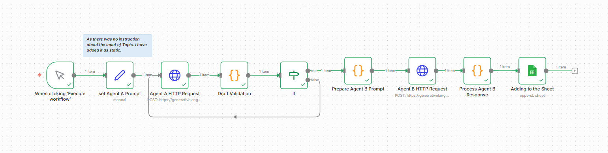

# Multi-Agent Gemini LinkedIn Workflow

This repository contains an automated **multi-agent content-generation workflow**, built in **n8n**, that creates polished LinkedIn posts using Google's **Gemini 2.5 Flash** model.  
The workflow uses two AI agents:

- **Agent A — Content Writer:** Creates a first-draft LinkedIn post based on a topic.  
- **Agent B — Editor & Critic:** Reviews, critiques, and rewrites the draft into a final polished LinkedIn post.

The workflow also performs:
- Draft validation  
- Hallucination detection  
- Token usage tracking  
- Cost estimation  
- Automatic logging to Google Sheets  

---

## 📸 Workflow Diagram

```md

